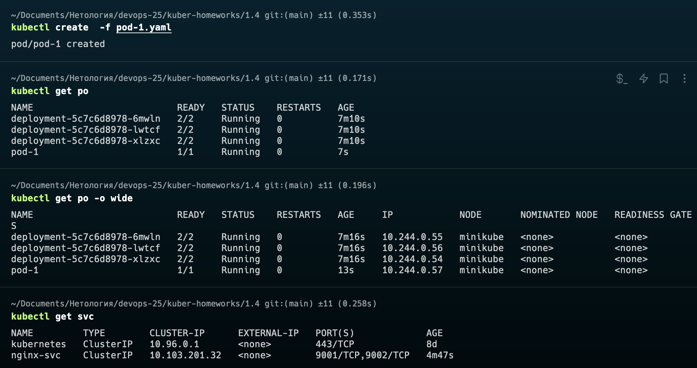
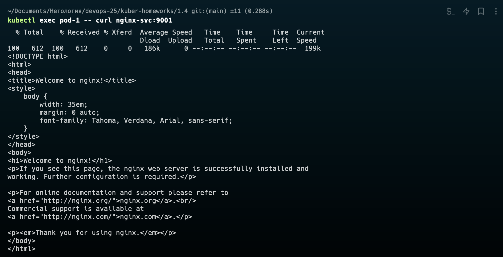
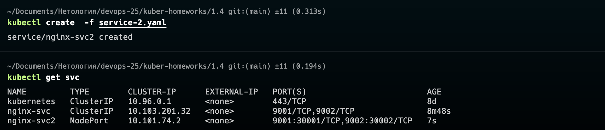
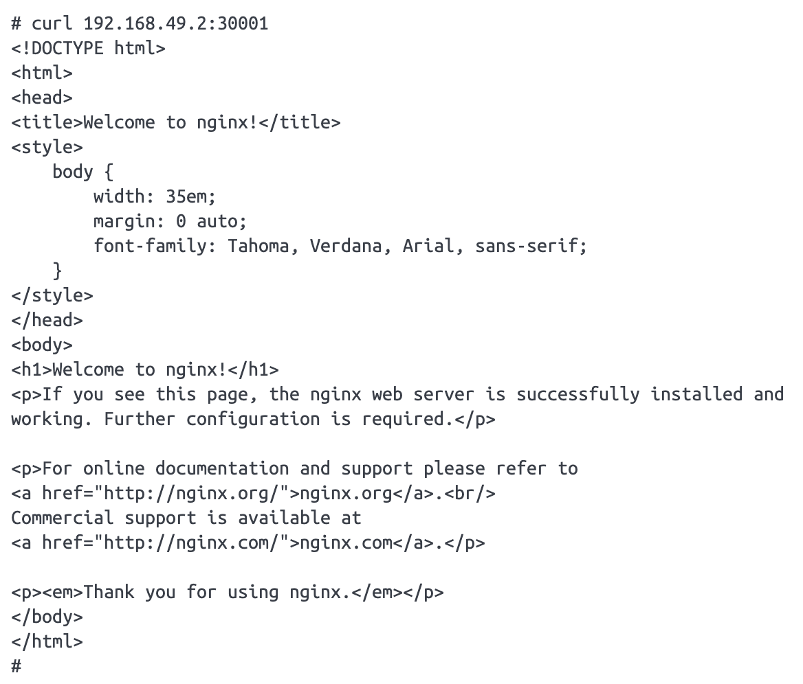

# Домашнее задание к занятию «Сетевое взаимодействие в K8S. Часть 1»

### Цель задания

В тестовой среде Kubernetes необходимо обеспечить доступ к приложению, установленному в предыдущем ДЗ и состоящему из двух контейнеров, по разным портам в разные контейнеры как внутри кластера, так и снаружи.

------

### Чеклист готовности к домашнему заданию

1. Установленное k8s-решение (например, MicroK8S).
2. Установленный локальный kubectl.
3. Редактор YAML-файлов с подключённым Git-репозиторием.

------

### Инструменты и дополнительные материалы, которые пригодятся для выполнения задания

1. [Описание](https://kubernetes.io/docs/concepts/workloads/controllers/deployment/) Deployment и примеры манифестов.
2. [Описание](https://kubernetes.io/docs/concepts/services-networking/service/) Описание Service.
3. [Описание](https://github.com/wbitt/Network-MultiTool) Multitool.

------

### Задание 1. Создать Deployment и обеспечить доступ к контейнерам приложения по разным портам из другого Pod внутри кластера

1. Создать Deployment приложения, состоящего из двух контейнеров (nginx и multitool), с количеством реплик 3 шт.
2. Создать Service, который обеспечит доступ внутри кластера до контейнеров приложения из п.1 по порту 9001 — nginx 80, по 9002 — multitool 8080.
3. Создать отдельный Pod с приложением multitool и убедиться с помощью `curl`, что из пода есть доступ до приложения из п.1 по разным портам в разные контейнеры.
4. Продемонстрировать доступ с помощью `curl` по доменному имени сервиса.
5. Предоставить манифесты Deployment и Service в решении, а также скриншоты или вывод команды п.4.

### Ответ 

1. Создать Deployment приложения, состоящего из двух контейнеров (nginx и multitool), с количеством реплик 3 шт.

[deployment-1](deployment-1.yaml)
```yaml
apiVersion: v1
kind: Deployment
metadata:
  name: deployment
  labels:
    app: nginx
spec:
  replicas: 3
  selector:
    matchLabels:
      app: nginx
  template:
    metadata:
      labels:
        app: nginx
    spec:
      containers:
      - name: nginx
        image: nginx:1.14.2
        ports:
        - containerPort: 80
      - name: multitool
        image: wbitt/network-multitool
        imagePullPolicy: IfNotPresent
        env:.
        - name: HTTP_PORT
          value: "8080"
        ports:
        - containerPort: 1180
          name: http-port
        resources:
            limits:
              cpu: 200m
              memory: 512Mi
```


2. Создать Service, который обеспечит доступ внутри кластера до контейнеров приложения из п.1 по порту 9001 — nginx 80, по 9002 — multitool 8080.

[service-1](service-1.yaml)
```yaml
apiVersion: v1
kind: Service
metadata:
  name: nginx-svc
spec:
  ports:
    - name: nginx
      port: 9001
      targetPort: 80
    - name: multitool
      port: 9002
      targetPort: 8080
  selector:
    app: nginx
```


3. Создать отдельный Pod с приложением multitool и убедиться с помощью `curl`, что из пода есть доступ до приложения из п.1 по разным портам в разные контейнеры.

[pod-1](pod-1.yaml)
```yaml
apiVersion: v1
kind: Pod
metadata:
  name: pod-1
  labels:
    app: pod-1
spec:
  containers:
    - name: multitool
      image: wbitt/network-multitool
      env:
        - name: HTTP_PORT
          value: "1080"
        - name: HTTPS_PORT
          value: "10443"
```



4. Продемонстрировать доступ с помощью `curl` по доменному имени сервиса. 



------

### Задание 2. Создать Service и обеспечить доступ к приложениям снаружи кластера

1. Создать отдельный Service приложения из Задания 1 с возможностью доступа снаружи кластера к nginx, используя тип NodePort.
2. Продемонстрировать доступ с помощью браузера или `curl` с локального компьютера.
3. Предоставить манифест и Service в решении, а также скриншоты или вывод команды п.2.

### Ответ

1. Создать отдельный Service приложения из Задания 1 с возможностью доступа снаружи кластера к nginx, используя тип NodePort.

[service-2](service-2.yaml)
```yaml
apiVersion: v1
kind: Service
metadata:
  name: nginx-svc2
spec:
  ports:
    - name: nginx
      port: 9001
      targetPort: 80
      nodePort: 30001
    - name: multitool
      port: 9002
      targetPort: 8080
      nodePort: 30002
  selector:
    app: nginx
  type: NodePort
```


2. Продемонстрировать доступ с помощью браузера или `curl` с локального компьютера.



