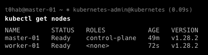

# Домашнее задание к занятию «Установка Kubernetes»

### Цель задания

Установить кластер K8s.

### Чеклист готовности к домашнему заданию

1. Развёрнутые ВМ с ОС Ubuntu 20.04-lts.


### Инструменты и дополнительные материалы, которые пригодятся для выполнения задания

1. [Инструкция по установке kubeadm](https://kubernetes.io/docs/setup/production-environment/tools/kubeadm/create-cluster-kubeadm/).
2. [Документация kubespray](https://kubespray.io/).

-----

### Задание 1. Установить кластер k8s с 1 master node

1. Подготовка работы кластера из 5 нод: 1 мастер и 4 рабочие ноды.
2. В качестве CRI — containerd.
3. Запуск etcd производить на мастере.
4. Способ установки выбрать самостоятельно.

## Дополнительные задания (со звёздочкой)

**Настоятельно рекомендуем выполнять все задания под звёздочкой.** Их выполнение поможет глубже разобраться в материале.   
Задания под звёздочкой необязательные к выполнению и не повлияют на получение зачёта по этому домашнему заданию. 

------
### Задание 2*. Установить HA кластер

1. Установить кластер в режиме HA.
2. Использовать нечётное количество Master-node.
3. Для cluster ip использовать keepalived или другой способ.

### Правила приёма работы

1. Домашняя работа оформляется в своем Git-репозитории в файле README.md. Выполненное домашнее задание пришлите ссылкой на .md-файл в вашем репозитории.
2. Файл README.md должен содержать скриншоты вывода необходимых команд `kubectl get nodes`, а также скриншоты результатов.
3. Репозиторий должен содержать тексты манифестов или ссылки на них в файле README.md.
------

### Решение

* Создаем ВМ в YC 


* Подключаемся к нашей мастер ноде


* Выполняем установку приложений kubeadm, kubelet, kubectl

```bash
apt-get install -y apt-transport-https ca-certificates curl
mkdir -p /etc/apt/keyrings
curl -fsSL https://packages.cloud.google.com/apt/doc/apt-key.gpg | gpg --dearmor -o /etc/apt/keyrings/kubernetes-archive-keyring.gpg
echo "deb [signed-by=/etc/apt/keyrings/kubernetes-archive-keyring.gpg] https://apt.kubernetes.io/ kubernetes-xenial main" | tee /etc/apt/sources.list.d/kubernetes.list
apt-get install -y kubelet kubeadm kubectl
apt-mark hold kubelet kubeadm kubectl
```

* Включаем IP Forward

```bash
root@master-01:~# modprobe br_netfilter
root@master-01:~# modprobe overlay
root@master-01:~# echo "net.ipv4.ip_forward=1" >> /etc/sysctl.conf
root@master-01:~# echo "net.bridge.bridge-nf-call-iptables=1" >> /etc/sysctl.conf
root@master-01:~# echo "net.bridge.bridge-nf-call-arptables=1" >> /etc/sysctl.conf
root@master-01:~# echo "net.bridge.bridge-nf-call-ip6tables=1" >> /etc/sysctl.conf
root@master-01:~# sysctl -p /etc/sysctl.conf
net.ipv4.ip_forward = 1
net.bridge.bridge-nf-call-iptables = 1
net.bridge.bridge-nf-call-arptables = 1
net.bridge.bridge-nf-call-ip6tables = 1
root@master-01:~# cat <<EOF | sudo tee /etc/modules-load.d/containerd.conf
> overlay
> br_netfilter
> EOF

overlay

br_netfilter

root@master-01:~#
```

* Ставим и настраиваем контейнеры с помощью `containerd`

```bash
apt-get install ca-certificates curl gnupg
install -m 0755 -d /etc/apt/keyrings
curl -fsSL https://download.docker.com/linux/ubuntu/gpg | gpg --dearmor -o /etc/apt/keyrings/docker.gpg
chmod a+r /etc/apt/keyrings/docker.gpg
echo "deb [arch="$(dpkg --print-architecture)" signed-by=/etc/apt/keyrings/docker.gpg] https://download.docker.com/linux/ubuntu "$(. /etc/os-release && echo "$VERSION_CODENAME")" stable" | tee /etc/apt/sources.list.d/docker.list > /dev/null
apt-get install containerd.io
mkdir -p /etc/containerd
containerd config default > /etc/containerd/config.toml
```

* Правим `config.toml`


* Перезапускаем сервис containerd и добавляем в автозагрузку сервис kubelet

```bash
root@master-01:~# systemctl restart containerd
root@master-01:~#
root@master-01:~# systemctl status containerd
● containerd.service - containerd container runtime
     Loaded: loaded (/lib/systemd/system/containerd.service; enabled; vendor preset: enabled)
     Active: active (running) since Sat 2024-02-10 13:11:35 UTC; 8s ago
       Docs: https://containerd.io
    Process: 5388 ExecStartPre=/sbin/modprobe overlay (code=exited, status=0/SUCCESS)
   Main PID: 5389 (containerd)
      Tasks: 11
     Memory: 12.3M
        CPU: 65ms
     CGroup: /system.slice/containerd.service
             └─5389 /usr/bin/containerd

Feb 10 13:11:35 master-01 containerd[5389]: time="2024-02-10T13:11:35.502361090Z" level=info msg="Start subscribing containerd event"
Feb 10 13:11:35 master-01 containerd[5389]: time="2024-02-10T13:11:35.502445754Z" level=info msg="Start recovering state"
Feb 10 13:11:35 master-01 containerd[5389]: time="2024-02-10T13:11:35.502476306Z" level=info msg=serving... address=/run/containerd/containerd.sock.ttrpc
Feb 10 13:11:35 master-01 containerd[5389]: time="2024-02-10T13:11:35.502521228Z" level=info msg=serving... address=/run/containerd/containerd.sock
Feb 10 13:11:35 master-01 containerd[5389]: time="2024-02-10T13:11:35.502532244Z" level=info msg="Start event monitor"
Feb 10 13:11:35 master-01 containerd[5389]: time="2024-02-10T13:11:35.502572701Z" level=info msg="Start snapshots syncer"
Feb 10 13:11:35 master-01 containerd[5389]: time="2024-02-10T13:11:35.502587221Z" level=info msg="Start cni network conf syncer for default"
Feb 10 13:11:35 master-01 containerd[5389]: time="2024-02-10T13:11:35.502598598Z" level=info msg="Start streaming server"
Feb 10 13:11:35 master-01 systemd[1]: Started containerd container runtime.
Feb 10 13:11:35 master-01 containerd[5389]: time="2024-02-10T13:11:35.504469302Z" level=info msg="containerd successfully booted in 0.024410s"
root@master-01:~# systemctl enable kubelet
```

* Выполняем установку 

```bash
root@master-01:~# kubeadm config images pull
I0210 13:34:19.378640    6624 version.go:256] remote version is much newer: v1.29.1; falling back to: stable-1.28
[config/images] Pulled registry.k8s.io/kube-apiserver:v1.28.6
[config/images] Pulled registry.k8s.io/kube-controller-manager:v1.28.6
[config/images] Pulled registry.k8s.io/kube-scheduler:v1.28.6
[config/images] Pulled registry.k8s.io/kube-proxy:v1.28.6
[config/images] Pulled registry.k8s.io/pause:3.9
[config/images] Pulled registry.k8s.io/etcd:3.5.9-0
[config/images] Pulled registry.k8s.io/coredns/coredns:v1.10.1
root@master-01:~#
```
```bash
root@master-01:~# kubeadm init --apiserver-advertise-address=10.128.0.26 --pod-network-cidr 10.244.0.0/16  --apiserver-cert-extra-sans=158.160.108.147,master-01.ru-central1.internal
I0210 13:39:11.552988    6939 version.go:256] remote version is much newer: v1.29.1; falling back to: stable-1.28
[init] Using Kubernetes version: v1.28.6
[preflight] Running pre-flight checks
...
[kubelet-start] Writing kubelet configuration to file "/var/lib/kubelet/config.yaml"
[kubelet-start] Starting the kubelet
[wait-control-plane] Waiting for the kubelet to boot up the control plane as static Pods from directory "/etc/kubernetes/manifests". This can take up to 4m0s
[apiclient] All control plane components are healthy after 6.502601 seconds
...

kubeadm join 10.128.0.26:6443 --token i4eo4n.til46v0hsydplmlv \
	--discovery-token-ca-cert-hash sha256:56f0a9aca0d9c5a5dfae6690f906e625db08fe2aacf97cbb69cd917105a1a321
root@master-01:~#
```

* Создаём kubeconfig на мастер-ноде

```bash
mkdir -p $HOME/.kube
sudo cp -i /etc/kubernetes/admin.conf $HOME/.kube/config
sudo chown $(id -u):$(id -g) $HOME/.kube/config
```
* Ставим сетевой плагин `flannel` на мастер-ноде

```bash 
kubectl apply -f https://github.com/coreos/flannel/raw/master/Documentation/kube-flannel.yml
namespace/kube-flannel created
clusterrole.rbac.authorization.k8s.io/flannel created
clusterrolebinding.rbac.authorization.k8s.io/flannel created
serviceaccount/flannel created
configmap/kube-flannel-cfg created
daemonset.apps/kube-flannel-ds created
```

* Приступаем конфигурировать воркер-ноды (ниже пример на worker-01)

```bash
apt-get install -y apt-transport-https ca-certificates curl
mkdir -p /etc/apt/keyrings
curl -fsSL https://packages.cloud.google.com/apt/doc/apt-key.gpg | gpg --dearmor -o /etc/apt/keyrings/kubernetes-archive-keyring.gpg
echo "deb [signed-by=/etc/apt/keyrings/kubernetes-archive-keyring.gpg] https://apt.kubernetes.io/ kubernetes-xenial main" | tee /etc/apt/sources.list.d/kubernetes.list
apt-get update
apt-get install -y kubelet kubeadm kubectl
apt-mark hold kubelet kubeadm kubectl
```
```bash
root@worker-01:~# modprobe br_netfilter
root@worker-01:~# modprobe overlay
root@worker-01:~# echo "net.ipv4.ip_forward=1" >> /etc/sysctl.conf
root@worker-01:~# echo "net.bridge.bridge-nf-call-iptables=1" >> /etc/sysctl.conf
root@worker-01:~# echo "net.bridge.bridge-nf-call-arptables=1" >> /etc/sysctl.conf
root@worker-01:~# echo "net.bridge.bridge-nf-call-ip6tables=1" >> /etc/sysctl.conf
root@worker-01:~# sysctl -p /etc/sysctl.conf
net.ipv4.ip_forward = 1
net.bridge.bridge-nf-call-iptables = 1
net.bridge.bridge-nf-call-arptables = 1
net.bridge.bridge-nf-call-ip6tables = 1
root@worker-01:~# cat <<EOF | sudo tee /etc/modules-load.d/containerd.conf
> overlay
> br_netfilter
> EOF

overlay
br_netfilter
root@worker-01:~#
```
```bash
apt-get install ca-certificates curl gnupg
install -m 0755 -d /etc/apt/keyrings
curl -fsSL https://download.docker.com/linux/ubuntu/gpg | gpg --dearmor -o /etc/apt/keyrings/docker.gpg
chmod a+r /etc/apt/keyrings/docker.gpg
echo "deb [arch="$(dpkg --print-architecture)" signed-by=/etc/apt/keyrings/docker.gpg] https://download.docker.com/linux/ubuntu "$(. /etc/os-release && echo "$VERSION_CODENAME")" stable" | tee /etc/apt/sources.list.d/docker.list > /dev/null
apt-get install containerd.io
mkdir -p /etc/containerd
containerd config default > /etc/containerd/config.toml
```
```bash
root@worker-01:~# systemctl restart containerd
root@worker-01:~# systemctl status containerd
● containerd.service - containerd container runtime
     Loaded: loaded (/lib/systemd/system/containerd.service; enabled; vendor preset: enabled)
     Active: active (running) since Sat 2024-02-10 14:24:01 UTC; 6s ago
       Docs: https://containerd.io
    Process: 5994 ExecStartPre=/sbin/modprobe overlay (code=exited, status=0/SUCCESS)
   Main PID: 5995 (containerd)
      Tasks: 8
     Memory: 12.0M
        CPU: 66ms
     CGroup: /system.slice/containerd.service
             └─5995 /usr/bin/containerd

Feb 10 14:24:01 worker-01 containerd[5995]: time="2024-02-10T14:24:01.610244176Z" level=info msg=serving... address=/run/containerd/containerd.sock.ttrpc
Feb 10 14:24:01 worker-01 containerd[5995]: time="2024-02-10T14:24:01.610288875Z" level=info msg=serving... address=/run/containerd/containerd.sock
Feb 10 14:24:01 worker-01 containerd[5995]: time="2024-02-10T14:24:01.610327382Z" level=info msg="Start subscribing containerd event"
Feb 10 14:24:01 worker-01 containerd[5995]: time="2024-02-10T14:24:01.610373551Z" level=info msg="Start recovering state"
Feb 10 14:24:01 worker-01 containerd[5995]: time="2024-02-10T14:24:01.610441266Z" level=info msg="Start event monitor"
Feb 10 14:24:01 worker-01 containerd[5995]: time="2024-02-10T14:24:01.610464526Z" level=info msg="Start snapshots syncer"
Feb 10 14:24:01 worker-01 containerd[5995]: time="2024-02-10T14:24:01.610477966Z" level=info msg="Start cni network conf syncer for default"
Feb 10 14:24:01 worker-01 containerd[5995]: time="2024-02-10T14:24:01.610489383Z" level=info msg="Start streaming server"
Feb 10 14:24:01 worker-01 systemd[1]: Started containerd container runtime.
Feb 10 14:24:01 worker-01 containerd[5995]: time="2024-02-10T14:24:01.612433878Z" level=info msg="containerd successfully booted in 0.028020s"
root@worker-01:~# systemctl enable kubelet
```

* Подключаем воркер в кластер кубера

```bash
root@worker-01:~# kubeadm join 10.128.0.26:6443 --token i4eo4n.til46v0hsydplmlv \
>       --discovery-token-ca-cert-hash sha256:56f0a9aca0d9c5a5dfae6690f906e625db08fe2aacf97cbb69cd917105a1a321
[preflight] Running pre-flight checks
[preflight] Reading configuration from the cluster...
[preflight] FYI: You can look at this config file with 'kubectl -n kube-system get cm kubeadm-config -o yaml'
[kubelet-start] Writing kubelet configuration to file "/var/lib/kubelet/config.yaml"
[kubelet-start] Writing kubelet environment file with flags to file "/var/lib/kubelet/kubeadm-flags.env"
[kubelet-start] Starting the kubelet
[kubelet-start] Waiting for the kubelet to perform the TLS Bootstrap...

This node has joined the cluster:
* Certificate signing request was sent to apiserver and a response was received.
* The Kubelet was informed of the new secure connection details.

Run 'kubectl get nodes' on the control-plane to see this node join the cluster.

root@worker-01:~#
```

* Проверяем состояние нашего кластера



* Аналогично настраиваем остальные воркеры


