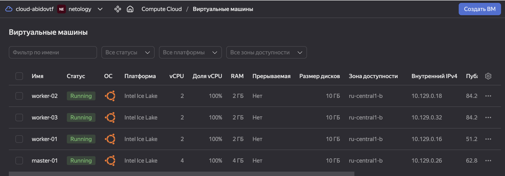
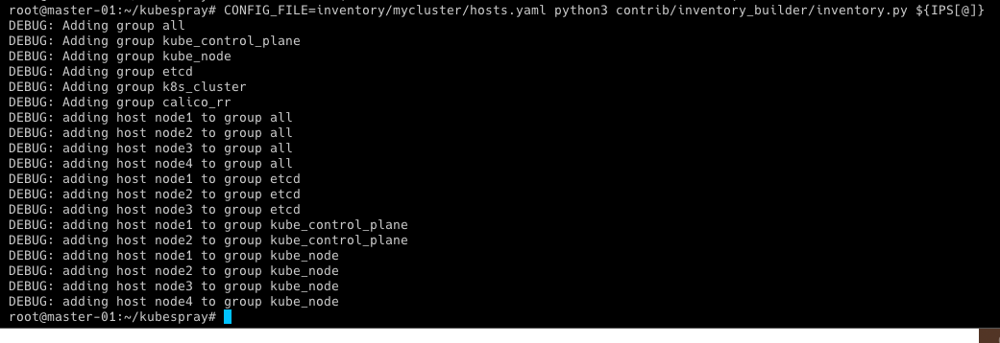
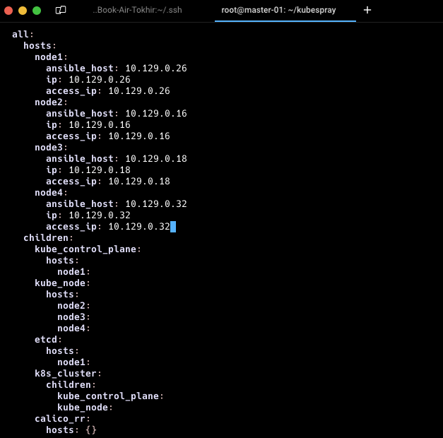
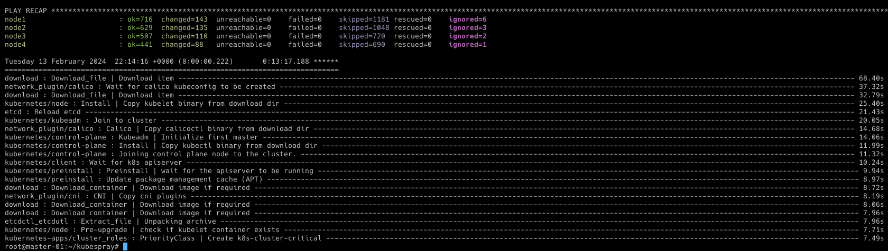

# Домашнее задание к занятию «Как работает сеть в K8s»

### Цель задания

Настроить сетевую политику доступа к подам.

### Чеклист готовности к домашнему заданию

1. Кластер K8s с установленным сетевым плагином Calico.

### Инструменты и дополнительные материалы, которые пригодятся для выполнения задания

1. [Документация Calico](https://www.tigera.io/project-calico/).
2. [Network Policy](https://kubernetes.io/docs/concepts/services-networking/network-policies/).
3. [About Network Policy](https://docs.projectcalico.org/about/about-network-policy).

-----

### Задание 1. Создать сетевую политику или несколько политик для обеспечения доступа

1. Создать deployment'ы приложений frontend, backend и cache и соответсвующие сервисы.
2. В качестве образа использовать network-multitool.
3. Разместить поды в namespace App.
4. Создать политики, чтобы обеспечить доступ frontend -> backend -> cache. Другие виды подключений должны быть запрещены.
5. Продемонстрировать, что трафик разрешён и запрещён.

### Правила приёма работы

1. Домашняя работа оформляется в своём Git-репозитории в файле README.md. Выполненное домашнее задание пришлите ссылкой на .md-файл в вашем репозитории.
2. Файл README.md должен содержать скриншоты вывода необходимых команд, а также скриншоты результатов.
3. Репозиторий должен содержать тексты манифестов или ссылки на них в файле README.md.

------
### Решение 

* Создаем виртуальные машины


* Выполним подготовку kubespray

```bash
apt-get install git pip -y
git clone https://github.com/kubernetes-sigs/kubespray
cd kubespray
pip3 install -r requirements.txt
cp -rfp inventory/sample inventory/mycluster
declare -a IPS=(10.129.0.26 10.129.0.16 10.129.0.32 10.129.0.18)
```

* Сгенерируем inventory-файл `hosts.yaml` для Ansible с использованием заданной переменной `IPS`



* Корректируем inventory-файл hosts.yaml таким образом, чтобы node1 была мастером, остальные - worker'ами. Etcd оставляем только на мастере



* Скопируем закрытый ключ с локальной машины на мастер-ноду

```bash
rsync --rsync-path="sudo rsync" /Users/t0hab/.ssh/id_rsa t0hab@62.84.121.172:/root/.ssh/id_rsa
```
```bash
root@master-01:~# ls .ssh/
authorized_keys  id_rsa
```

* Применим конфигурацию Ansible для узлов кластера и создадим kubeconfig-файл для пользователя admin

```bash
ansible-playbook -i inventory/mycluster/hosts.yaml -u admin -b -v --private-key=/root/.ssh/id_rsa cluster.yml
```



* Создание и настройка kubeconfig-файла 

```bash
mkdir -p $HOME/.kube
sudo cp -i /etc/kubernetes/admin.conf $HOME/.kube/config
sudo chown $(id -u):$(id -g) $HOME/.kube/config
```

* Проверяем состояния нод в кластере Kubernetes

```bash
kubectl get nodes
NAME    STATUS   ROLES           AGE   VERSION
node1   Ready    control-plane   21m   v1.29.1
node2   Ready    control-plane   21m   v1.29.1
node3   Ready    <none>          20m   v1.29.1
node4   Ready    <none>          20m   v1.29.1
```

* Проверяем состояния подов в кластере Kubernetes

```bash
kubectl get po -A
NAMESPACE     NAME                                      READY   STATUS    RESTARTS   AGE
kube-system   calico-kube-controllers-648dffd99-c4v7g   1/1     Running   0          21m
kube-system   calico-node-894f9                         1/1     Running   0          22m
kube-system   calico-node-kgd9r                         1/1     Running   0          22m
kube-system   calico-node-kgm8l                         1/1     Running   0          22m
kube-system   calico-node-v4569                         1/1     Running   0          22m
kube-system   coredns-69db55dd76-6j889                  1/1     Running   0          20m
kube-system   coredns-69db55dd76-6tqs2                  1/1     Running   0          21m
kube-system   dns-autoscaler-6f4b597d8c-6v7zz           1/1     Running   0          21m
kube-system   kube-apiserver-node1                      1/1     Running   1          23m
kube-system   kube-apiserver-node2                      1/1     Running   1          23m
kube-system   kube-controller-manager-node1             1/1     Running   2          23m
kube-system   kube-controller-manager-node2             1/1     Running   2          23m
kube-system   kube-proxy-74h5v                          1/1     Running   0          7m6s
kube-system   kube-proxy-8dl26                          1/1     Running   0          7m5s
kube-system   kube-proxy-gql9k                          1/1     Running   0          7m6s
kube-system   kube-proxy-ltztw                          1/1     Running   0          7m5s
kube-system   kube-scheduler-node1                      1/1     Running   1          23m
kube-system   kube-scheduler-node2                      1/1     Running   1          23m
kube-system   nginx-proxy-node3                         1/1     Running   0          22m
kube-system   nginx-proxy-node4                         1/1     Running   0          22m
kube-system   nodelocaldns-f7n7b                        1/1     Running   0          20m
kube-system   nodelocaldns-rf59l                        1/1     Running   0          20m
kube-system   nodelocaldns-rjm7b                        1/1     Running   0          20m
kube-system   nodelocaldns-tthss                        1/1     Running   0          20m
```

* Создадим namespace app

```bash
vim namespace.yaml
```
```yaml
apiVersion: v1
kind: Namespace
metadata:
  name: app
```
```bash
kubectl create -f namespace.yaml
namespace/app created
kubectl get namespaces
NAME              STATUS   AGE
app               Active   9s
default           Active   29m
kube-node-lease   Active   29m
kube-public       Active   29m
kube-system       Active   29m
```

* Создадим deployment и service для приложения frontend

Опишем конфигурационный файл deployment-frontend.yaml
```yaml
apiVersion: apps/v1
kind: Deployment
metadata:
  labels:
    app: deployment-frontend
  name: deployment-frontend
  namespace: app
spec:
  replicas: 1
  selector:
    matchLabels:
      app: frontend
  template:
    metadata:
      labels:
        app: frontend
    spec:
      containers:
        - name: frontend-multitool
          image: wbitt/network-multitool
```          

Опишем конфигурационный файл service-frontend.yaml
```bash
kubectl create -f deployment-frontend.yaml
deployment.apps/deployment-frontend created
kubectl create -f service-frontend.yaml
service/service-frontend created
```

* Создадим deployment и service для приложения backend

конфигурационный файл deployment-backend.yaml
```yaml
apiVersion: apps/v1
kind: Deployment
metadata:
  labels:
    app: deployment-backend
  name: deployment-backend
  namespace: app
spec:
  replicas: 1
  selector:
    matchLabels:
      app: backend
  template:
    metadata:
      labels:
        app: backend
    spec:
      containers:
        - name: backend-multitool
          image: wbitt/network-multitool
```
конфигурационный файл service-backend.yaml
```yaml
apiVersion: v1
kind: Service
metadata:
  name: service-backend
  namespace: app
spec:
  selector:
    app: backend
  ports:
    - name: port-80
      port: 80
      targetPort: 80
```
* Применим deployment и service для приложения backend
```bash
kubectl create -f deployment-backend.yaml
deployment.apps/deployment-backend created
kubectl create -f service-backend.yaml
service/service-backend created
```

* Создадим deployment и service для приложения cache

конфигурационный файл deployment-cache.yaml
```yaml
apiVersion: apps/v1
kind: Deployment
metadata:
  labels:
    app: deployment-cache
  name: deployment-cache
  namespace: app
spec:
  replicas: 1
  selector:
    matchLabels:
      app: cache
  template:
    metadata:
      labels:
        app: cache
    spec:
      containers:
        - name: cache-multitool
          image: wbitt/network-multitool
```
конфигурационный файл service-cache.yaml
```yaml
apiVersion: v1
kind: Service
metadata:
  name: service-cache
  namespace: app
spec:
  selector:
    app: cache
  ports:
    - name: port-80
      port: 80
      targetPort: 80
```
```bash
kubectl create -f deployment-cache.yaml
deployment.apps/deployment-cache created
kubectl create -f service-cache.yaml
service/service-cache created
```

* Убедимся в успешности развертывания подов и сервисов
```bash
kubectl get pods,services -n app -o wide
NAME                                      READY   STATUS    RESTARTS   AGE     IP             NODE    NOMINATED NODE   READINESS GATES
pod/deployment-backend-59f8c49bdb-4vqwb   1/1     Running   0          11m     10.233.74.66   node4   <none>           <none>
pod/deployment-cache-69b486bc58-sbd7t     1/1     Running   0          7m29s   10.233.71.3    node3   <none>           <none>
pod/deployment-frontend-8cc5b69b4-n7h6x   1/1     Running   0          15m     10.233.71.2    node3   <none>           <none>

NAME                       TYPE        CLUSTER-IP     EXTERNAL-IP   PORT(S)   AGE    SELECTOR
service/service-backend    ClusterIP   10.233.8.227   <none>        80/TCP    11m    app=backend
service/service-cache      ClusterIP   10.233.56.24   <none>        80/TCP    101s   app=cache
service/service-frontend   ClusterIP   10.233.6.66    <none>        80/TCP    14m    app=frontend
```

* Перед конфигурированием сетевых политик убедимся, что поды имеют неограниченный доступ друг к другу внутри namespace app

```bash
kubectl exec -it service/service-frontend -n app -- curl --silent -i service-backend.app.svc.cluster.local | grep Server
Server: nginx/1.24.0
kubectl exec -it service/service-backend -n app -- curl --silent -i service-cache.app.svc.cluster.local | grep Server
Server: nginx/1.24.0
kubectl exec -it service/service-frontend -n app -- curl --silent -i service-cache.app.svc.cluster.local | grep Server
Server: nginx/1.24.0
kubectl exec -it service/service-cache -n app -- curl --silent -i service-frontend.app.svc.cluster.local | grep Server
Server: nginx/1.24.0
```
* Создадим и применим сетевую политику, запрещающую подключения, не разрешённые специально

конфигурационный файл netpolicy-default.yaml
```yaml
apiVersion: networking.k8s.io/v1
kind: NetworkPolicy
metadata:
  name: default-deny-ingress
  namespace: app
spec:
  podSelector: {}
  policyTypes:
    - Ingress
```
Применим политику по умолчанию
```bash
kubectl create -f netpolicy-default.yaml
networkpolicy.networking.k8s.io/default-deny-ingress created
```

* Создадим и применим сетевую политику, разрешающую подключения от frontend к backend

конфигурационный файл netpolicy-front-back.yaml
```yaml
apiVersion: networking.k8s.io/v1
kind: NetworkPolicy
metadata:
  name: frontend-to-backend-policy
  namespace: app
spec:
  podSelector:
    matchLabels:
      app: backend
  policyTypes:
    - Ingress
  ingress:
    - from:
      - podSelector:
          matchLabels:
            app: frontend
      ports:
        - protocol: TCP
          port: 80
        - protocol: TCP
          port: 443
```
```bash
kubectl create -f netpolicy-front-back.yaml
networkpolicy.networking.k8s.io/frontend-to-backend-policy created
```

* Создадим и применим сетевую политику, разрешающую подключения от backend к cache

конфигурационный файл netpolicy-back-cache.yaml
```yaml
apiVersion: networking.k8s.io/v1
kind: NetworkPolicy
metadata:
  name: backend-to-cache-policy
  namespace: app
spec:
  podSelector:
    matchLabels:
      app: cache
  policyTypes:
    - Ingress
  ingress:
    - from:
      - podSelector:
          matchLabels:
            app: backend
      ports:
        - protocol: TCP
          port: 80
        - protocol: TCP
          port: 443
```
```bash
kubectl create -f netpolicy-back-cache.yaml
networkpolicy.networking.k8s.io/backend-to-cache-policy created
```

* Проверим примененные сетевые политики
```bash
kubectl get networkpolicy -A
NAMESPACE   NAME                         POD-SELECTOR   AGE
app         backend-to-cache-policy      app=cache      23s
app         default-deny-ingress         <none>         3m3s
app         frontend-to-backend-policy   app=backend    105s
```

* Проверим работу настроенных сетевых политик

Доступ должен быть от frontend к backend

```bash
kubectl exec -it service/service-frontend -n app -- curl --silent -i service-backend.app.svc.cluster.local | grep Server
Server: nginx/1.24.0
```
Доступ должен быть от backend к cache
```bash
kubectl exec -it service/service-backend -n app -- curl --silent -i service-cache.app.svc.cluster.local | grep Server
Server: nginx/1.24.0
```
Доступа не должно быть в иных случаях
```bash
kubectl exec -it service/service-frontend -n app -- curl --silent -i service-cache.app.svc.cluster.local | grep Server
command terminated with exit code 130
kubectl exec -it service/service-cache -n app -- curl --silent -i service-frontend.app.svc.cluster.local | grep Server
command terminated with exit code 130
```

### Всё работает корректно. Есть доступ от frontend к backend и от backend к cache. Проверено, что нет доступа от backend к cache и от cache к frontend. В последних случаях происходит "зависание" на 2 минуты, потом выполнение команды завершается с кодом возврата 130