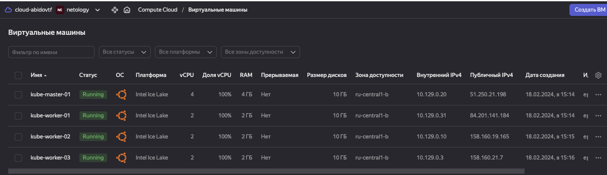
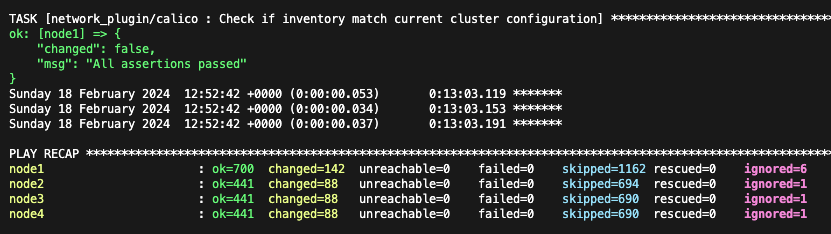

# Домашнее задание к занятию «Обновление приложений»

### Цель задания

Выбрать и настроить стратегию обновления приложения.

### Чеклист готовности к домашнему заданию

1. Кластер K8s.

### Инструменты и дополнительные материалы, которые пригодятся для выполнения задания

1. [Документация Updating a Deployment](https://kubernetes.io/docs/concepts/workloads/controllers/deployment/#updating-a-deployment).
2. [Статья про стратегии обновлений](https://habr.com/ru/companies/flant/articles/471620/).

-----

### Задание 1. Выбрать стратегию обновления приложения и описать ваш выбор

1. Имеется приложение, состоящее из нескольких реплик, которое требуется обновить.
2. Ресурсы, выделенные для приложения, ограничены, и нет возможности их увеличить.
3. Запас по ресурсам в менее загруженный момент времени составляет 20%.
4. Обновление мажорное, новые версии приложения не умеют работать со старыми.
5. Вам нужно объяснить свой выбор стратегии обновления приложения.

### Задание 2. Обновить приложение

1. Создать deployment приложения с контейнерами nginx и multitool. Версию nginx взять 1.19. Количество реплик — 5.
2. Обновить версию nginx в приложении до версии 1.20, сократив время обновления до минимума. Приложение должно быть доступно.
3. Попытаться обновить nginx до версии 1.28, приложение должно оставаться доступным.
4. Откатиться после неудачного обновления.

## Дополнительные задания — со звёздочкой*

Задания дополнительные, необязательные к выполнению, они не повлияют на получение зачёта по домашнему заданию. **Но мы настоятельно рекомендуем вам выполнять все задания со звёздочкой.** Это поможет лучше разобраться в материале.   

### Задание 3*. Создать Canary deployment

1. Создать два deployment'а приложения nginx.
2. При помощи разных ConfigMap сделать две версии приложения — веб-страницы.
3. С помощью ingress создать канареечный деплоймент, чтобы можно было часть трафика перебросить на разные версии приложения.

### Правила приёма работы

1. Домашняя работа оформляется в своем Git-репозитории в файле README.md. Выполненное домашнее задание пришлите ссылкой на .md-файл в вашем репозитории.
2. Файл README.md должен содержать скриншоты вывода необходимых команд, а также скриншоты результатов.
3. Репозиторий должен содержать тексты манифестов или ссылки на них в файле README.md.

## Решение

* Создадим виртуальные машины в YC



* Подключаемся к виртуальной машине kube-master-01 и начинаем ее конфигурирование

```bash
apt-get update -y
apt-get install git pip -y
git clone https://github.com/kubernetes-sigs/kubespray
cd kubespray
pip3 install -r requirements.txt
cp -rfp inventory/sample inventory/mycluster
declare -a IPS=(10.129.0.20 10.129.0.31 10.129.0.10 10.129.0.3
```

* Сгенерируем inventory-файл hosts.yaml для Ansible с использованием заданной переменной IPS:

```bash
root@kube-master-01:~/kubespray# CONFIG_FILE=inventory/mycluster/hosts.yaml python3 contrib/inventory_builder/inventory.py ${IPS[@]}
DEBUG: Adding group all
DEBUG: Adding group kube_control_plane
DEBUG: Adding group kube_node
DEBUG: Adding group etcd
DEBUG: Adding group k8s_cluster
DEBUG: Adding group calico_rr
DEBUG: adding host node1 to group all
DEBUG: adding host node2 to group all
DEBUG: adding host node3 to group all
DEBUG: adding host node4 to group all
DEBUG: adding host node1 to group etcd
DEBUG: adding host node2 to group etcd
DEBUG: adding host node3 to group etcd
DEBUG: adding host node1 to group kube_control_plane
DEBUG: adding host node2 to group kube_control_plane
DEBUG: adding host node1 to group kube_node
DEBUG: adding host node2 to group kube_node
DEBUG: adding host node3 to group kube_node
DEBUG: adding host node4 to group kube_node
```
* Корректируем inventory-файл hosts.yaml таким образом, чтобы node1 была мастером, остальные - worker'ами. Etcd оставляем только на мастере:

```yaml
root@kube-master-01:~/kubespray# cat inventory/mycluster/hosts.yaml
all:
  hosts:
    node1:
      ansible_host: 10.129.0.20
      ip: 10.129.0.20
      access_ip: 10.129.0.20
    node2:
      ansible_host: 10.129.0.31
      ip: 10.129.0.31
      access_ip: 10.129.0.31
    node3:
      ansible_host: 10.129.0.10
      ip: 10.129.0.10
      access_ip: 10.129.0.10
    node4:
      ansible_host: 10.129.0.3
      ip: 10.129.0.3
      access_ip: 10.129.0.3
  children:
    kube_control_plane:
      hosts:
        node1:
    kube_node:
      hosts:
        node2:
        node3:
        node4:
    etcd:
      hosts:
        node1:
    k8s_cluster:
      children:
        kube_control_plane:
        kube_node:
    calico_rr:
      hosts: {}
```

* Скопируем закрытый ключ с локальной машины на мастер-ноду:

```bash
rsync --rsync-path="sudo rsync" /Users/t0hab/.ssh/id_rsa t0hab@51.250.21.198:/root/.ssh/id_rsa
```
```bash
root@kube-master-01:~/kubespray# ll /root/.ssh/id_rsa 
-rw------- 1 root root 2622 Feb 18 12:34 /root/.ssh/id_rsa
```
* Применим конфигурацию Ansible для узлов кластера и создадим kubeconfig-файл для пользователя admin

```bash
root@kube-master-01:~# ansible-playbook -i inventory/mycluster/hosts.yaml -u t0hab -b -v --private-key=/root/.ssh/id_rsa cluster.yml
```


* Создание и настройка kubeconfig-файла для пользователя

```bash
t0hab@kube-master-01:~$ mkdir -p $HOME/.kube
t0hab@kube-master-01:~$ sudo cp -i /etc/kubernetes/admin.conf $HOME/.kube/config
t0hab@kube-master-01:~$ sudo chown $(id -u):$(id -g) $HOME/.kube/config
```

* Проверяем состояния нод и подов в кластере
```bash
t0hab@kube-master-01:~$ kubectl get nodes
NAME    STATUS   ROLES           AGE     VERSION
node1   Ready    control-plane   9m44s   v1.29.2
node2   Ready    <none>          9m10s   v1.29.2
node3   Ready    <none>          9m10s   v1.29.2
node4   Ready    <none>          9m12s   v1.29.2

t0hab@kube-master-01:~$ kubectl get po -A
NAMESPACE     NAME                                      READY   STATUS    RESTARTS   AGE
kube-system   calico-kube-controllers-648dffd99-9zmlk   1/1     Running   0          8m2s
kube-system   calico-node-58jwc                         1/1     Running   0          9m13s
kube-system   calico-node-5t2lh                         1/1     Running   0          9m13s
kube-system   calico-node-89tqd                         1/1     Running   0          9m13s
kube-system   calico-node-8t58p                         1/1     Running   0          9m13s
kube-system   coredns-69db55dd76-9sxz5                  1/1     Running   0          7m45s
kube-system   coredns-69db55dd76-qg7xj                  1/1     Running   0          7m53s
kube-system   dns-autoscaler-6f4b597d8c-pmcrw           1/1     Running   0          7m51s
kube-system   kube-apiserver-node1                      1/1     Running   1          10m
kube-system   kube-controller-manager-node1             1/1     Running   2          10m
kube-system   kube-proxy-4t9t6                          1/1     Running   0          10m
kube-system   kube-proxy-6jvxw                          1/1     Running   0          10m
kube-system   kube-proxy-hhppn                          1/1     Running   0          10m
kube-system   kube-proxy-lxffz                          1/1     Running   0          10m
kube-system   kube-scheduler-node1                      1/1     Running   1          10m
kube-system   nginx-proxy-node2                         1/1     Running   0          10m
kube-system   nginx-proxy-node3                         1/1     Running   0          10m
kube-system   nginx-proxy-node4                         1/1     Running   0          10m
kube-system   nodelocaldns-bkft2                        1/1     Running   0          7m50s
kube-system   nodelocaldns-cqjmp                        1/1     Running   0          7m50s
kube-system   nodelocaldns-lddpk                        1/1     Running   0          7m50s
kube-system   nodelocaldns-sl95s                        1/1     Running   0          7m50s
```

### Обновление приложения 

* Создадим первый yaml-файл deployment для приложений nginx и multitool. Версию nginx будем использовать 1.19. Количество реплик — 5

```yaml
t0hab@kube-master-01:~/3.4$ vim deployment1.yaml
t0hab@kube-master-01:~/3.4$ cat deployment1.yaml 
---
apiVersion: apps/v1
kind: Deployment
metadata:
  name: deployment
  labels:
    app: nginx-multitool
  annotations:
    kubernetes.io/change-cause: "nginx 1.19"
spec:
  replicas: 5
  strategy:
    type: RollingUpdate
    rollingUpdate:
      maxSurge: 50%
      maxUnavailable: 50%
  selector:
    matchLabels:
      app: nginx-multitool
  template:
    metadata:
      labels:
        app: nginx-multitool
    spec:
      containers:
      - name: nginx
        image: nginx:1.19
        ports:
          - containerPort: 80
      - name: multitool
        image: wbitt/network-multitool
        ports:
          - containerPort: 8080
        env:
          - name: HTTP_PORT
            value: "8080"
          - name: HTTPS_PORT
            value: "11443"
```

* Запустим развертывание deployment1.yaml и проверим результат

```bash
t0hab@kube-master-01:~/3.4$ kubectl apply -f deployment1.yaml
deployment.apps/deployment created
t0hab@kube-master-01:~/3.4$ kubectl get deployments,pods -o wide
NAME                         READY   UP-TO-DATE   AVAILABLE   AGE   CONTAINERS        IMAGES                               SELECTOR
deployment.apps/deployment   0/5     5            0           7s    nginx,multitool   nginx:1.19,wbitt/network-multitool   app=nginx-multitool

NAME                              READY   STATUS              RESTARTS   AGE   IP       NODE    NOMINATED NODE   READINESS GATES
pod/deployment-798685456b-dhqhz   0/2     ContainerCreating   0          7s    <none>   node4   <none>           <none>
pod/deployment-798685456b-jbhf5   0/2     ContainerCreating   0          7s    <none>   node4   <none>           <none>
pod/deployment-798685456b-mb6d6   0/2     ContainerCreating   0          7s    <none>   node3   <none>           <none>
pod/deployment-798685456b-ncx6w   0/2     ContainerCreating   0          7s    <none>   node3   <none>           <none>
pod/deployment-798685456b-zdgdr   0/2     ContainerCreating   0          7s    <none>   node2   <none>           <none>
```

* Создадим второй yaml-файл deployment для приложений nginx и multitool. Версию nginx будем использовать 1.20. Количество реплик — 5.

```yaml
t0hab@kube-master-01:~/3.4$ vim deployment2.yaml
t0hab@kube-master-01:~/3.4$ cat deployment2.yaml 
---
apiVersion: apps/v1
kind: Deployment
metadata:
  name: deployment
  labels:
    app: nginx-multitool
  annotations:
    kubernetes.io/change-cause: "nginx 1.20"
spec:
  replicas: 5
  strategy:
    type: RollingUpdate
    rollingUpdate:
      maxSurge: 50%
      maxUnavailable: 50%
  selector:
    matchLabels:
      app: nginx-multitool
  template:
    metadata:
      labels:
        app: nginx-multitool
    spec:
      containers:
      - name: nginx
        image: nginx:1.20
        ports:
          - containerPort: 80
      - name: multitool
        image: wbitt/network-multitool
        ports:
          - containerPort: 8080
        env:
          - name: HTTP_PORT
            value: "8080"
          - name: HTTPS_PORT
            value: "11443"
```

* Запустим развертывание deployment2.yaml для обновления работающих подов и проверим результат

```bash
t0hab@kube-master-01:~/3.4$ kubectl apply -f deployment2.yaml
deployment.apps/deployment configured
t0hab@kube-master-01:~/3.4$ kubectl get deployments,pods,replicasets -o wide
NAME                         READY   UP-TO-DATE   AVAILABLE   AGE     CONTAINERS        IMAGES                               SELECTOR
deployment.apps/deployment   3/5     5            3           2m24s   nginx,multitool   nginx:1.20,wbitt/network-multitool   app=nginx-multitool

NAME                              READY   STATUS              RESTARTS   AGE     IP             NODE    NOMINATED NODE   READINESS GATES
pod/deployment-798685456b-jbhf5   2/2     Running             0          2m24s   10.233.74.66   node4   <none>           <none>
pod/deployment-798685456b-ncx6w   2/2     Running             0          2m24s   10.233.71.3    node3   <none>           <none>
pod/deployment-798685456b-zdgdr   2/2     Running             0          2m24s   10.233.75.3    node2   <none>           <none>
pod/deployment-7d864bd5d-cv48m    0/2     ContainerCreating   0          5s      <none>         node3   <none>           <none>
pod/deployment-7d864bd5d-m4t67    0/2     ContainerCreating   0          5s      <none>         node4   <none>           <none>
pod/deployment-7d864bd5d-mkl9t    0/2     ContainerCreating   0          5s      <none>         node2   <none>           <none>
pod/deployment-7d864bd5d-p6sqh    0/2     ContainerCreating   0          5s      <none>         node2   <none>           <none>
pod/deployment-7d864bd5d-wvcqz    0/2     ContainerCreating   0          5s      <none>         node4   <none>           <none>

NAME                                    DESIRED   CURRENT   READY   AGE     CONTAINERS        IMAGES                               SELECTOR
replicaset.apps/deployment-798685456b   3         3         3       2m24s   nginx,multitool   nginx:1.19,wbitt/network-multitool   app=nginx-multitool,pod-template-hash=798685456b
replicaset.apps/deployment-7d864bd5d    5         5         0       5s      nginx,multitool   nginx:1.20,wbitt/network-multitool   app=nginx-multitool,pod-template-hash=7d864bd5d
t0hab@kube-master-01:~/3.4$ 
t0hab@kube-master-01:~/3.4$ kubectl get deployments,pods,replicasets -o wide
NAME                         READY   UP-TO-DATE   AVAILABLE   AGE    CONTAINERS        IMAGES                               SELECTOR
deployment.apps/deployment   5/5     5            5           3m2s   nginx,multitool   nginx:1.20,wbitt/network-multitool   app=nginx-multitool

NAME                             READY   STATUS    RESTARTS   AGE   IP             NODE    NOMINATED NODE   READINESS GATES
pod/deployment-7d864bd5d-cv48m   2/2     Running   0          43s   10.233.71.4    node3   <none>           <none>
pod/deployment-7d864bd5d-m4t67   2/2     Running   0          43s   10.233.74.68   node4   <none>           <none>
pod/deployment-7d864bd5d-mkl9t   2/2     Running   0          43s   10.233.75.4    node2   <none>           <none>
pod/deployment-7d864bd5d-p6sqh   2/2     Running   0          43s   10.233.75.5    node2   <none>           <none>
pod/deployment-7d864bd5d-wvcqz   2/2     Running   0          43s   10.233.74.69   node4   <none>           <none>

NAME                                    DESIRED   CURRENT   READY   AGE    CONTAINERS        IMAGES                               SELECTOR
replicaset.apps/deployment-798685456b   0         0         0       3m2s   nginx,multitool   nginx:1.19,wbitt/network-multitool   app=nginx-multitool,pod-template-hash=798685456b
replicaset.apps/deployment-7d864bd5d    5         5         5       43s    nginx,multitool   nginx:1.20,wbitt/network-multitool   app=nginx-multitool,pod-template-hash=7d864bd5d
t0hab@kube-master-01:~/3.4$ 
```

* Создадим третий yaml-файл deployment для приложений nginx и multitool. Версию nginx будем использовать 1.28 (пока не существующая). Количество реплик — 5.

```yaml
t0hab@kube-master-01:~/3.4$ vim deployment3.yaml
t0hab@kube-master-01:~/3.4$ cat deployment3.yaml
---
apiVersion: apps/v1
kind: Deployment
metadata:
  name: deployment
  labels:
    app: nginx-multitool
  annotations:
    kubernetes.io/change-cause: "nginx 1.28"
spec:
  replicas: 5
  strategy:
    type: RollingUpdate
    rollingUpdate:
      maxSurge: 50%
      maxUnavailable: 50%
  selector:
    matchLabels:
      app: nginx-multitool
  template:
    metadata:
      labels:
        app: nginx-multitool
    spec:
      containers:
      - name: nginx
        image: nginx:1.28
        ports:
          - containerPort: 80
      - name: multitool
        image: wbitt/network-multitool
        ports:
          - containerPort: 8080
        env:
          - name: HTTP_PORT
            value: "8080"
          - name: HTTPS_PORT
            value: "11443"
```

* Попробуем выполнить развертывание deployment3.yaml для обновления работающих подов и проверим результат

```bash
t0hab@kube-master-01:~/3.4$ kubectl apply -f deployment3.yaml
deployment.apps/deployment configured
t0hab@kube-master-01:~/3.4$ kubectl get deployments,pods,replicasets -o wide
NAME                         READY   UP-TO-DATE   AVAILABLE   AGE     CONTAINERS        IMAGES                               SELECTOR
deployment.apps/deployment   3/5     5            3           7m38s   nginx,multitool   nginx:1.28,wbitt/network-multitool   app=nginx-multitool

NAME                              READY   STATUS              RESTARTS   AGE     IP             NODE    NOMINATED NODE   READINESS GATES
pod/deployment-7bd674dfdb-68pbx   0/2     ContainerCreating   0          7s      <none>         node3   <none>           <none>
pod/deployment-7bd674dfdb-cwdhg   1/2     ErrImagePull        0          7s      10.233.71.5    node3   <none>           <none>
pod/deployment-7bd674dfdb-gtmvv   1/2     ImagePullBackOff    0          7s      10.233.75.6    node2   <none>           <none>
pod/deployment-7bd674dfdb-js8ff   1/2     ErrImagePull        0          7s      10.233.74.70   node4   <none>           <none>
pod/deployment-7bd674dfdb-nm6p7   0/2     ContainerCreating   0          7s      <none>         node4   <none>           <none>
pod/deployment-7d864bd5d-cv48m    2/2     Running             0          5m19s   10.233.71.4    node3   <none>           <none>
pod/deployment-7d864bd5d-m4t67    2/2     Running             0          5m19s   10.233.74.68   node4   <none>           <none>
pod/deployment-7d864bd5d-wvcqz    2/2     Running             0          5m19s   10.233.74.69   node4   <none>           <none>

NAME                                    DESIRED   CURRENT   READY   AGE     CONTAINERS        IMAGES                               SELECTOR
replicaset.apps/deployment-798685456b   0         0         0       7m38s   nginx,multitool   nginx:1.19,wbitt/network-multitool   app=nginx-multitool,pod-template-hash=798685456b
replicaset.apps/deployment-7bd674dfdb   5         5         0       7s      nginx,multitool   nginx:1.28,wbitt/network-multitool   app=nginx-multitool,pod-template-hash=7bd674dfdb
replicaset.apps/deployment-7d864bd5d    3         3         3       5m19s   nginx,multitool   nginx:1.20,wbitt/network-multitool   app=nginx-multitool,pod-template-hash=7d864bd5d
t0hab@kube-master-01:~/3.4$ kubectl get deployments,pods,replicasets -o wide
NAME                         READY   UP-TO-DATE   AVAILABLE   AGE     CONTAINERS        IMAGES                               SELECTOR
deployment.apps/deployment   3/5     5            3           7m49s   nginx,multitool   nginx:1.28,wbitt/network-multitool   app=nginx-multitool

NAME                              READY   STATUS             RESTARTS   AGE     IP             NODE    NOMINATED NODE   READINESS GATES
pod/deployment-7bd674dfdb-68pbx   1/2     ImagePullBackOff   0          18s     10.233.71.6    node3   <none>           <none>
pod/deployment-7bd674dfdb-cwdhg   1/2     ImagePullBackOff   0          18s     10.233.71.5    node3   <none>           <none>
pod/deployment-7bd674dfdb-gtmvv   1/2     ImagePullBackOff   0          18s     10.233.75.6    node2   <none>           <none>
pod/deployment-7bd674dfdb-js8ff   1/2     ImagePullBackOff   0          18s     10.233.74.70   node4   <none>           <none>
pod/deployment-7bd674dfdb-nm6p7   1/2     ImagePullBackOff   0          18s     10.233.74.71   node4   <none>           <none>
pod/deployment-7d864bd5d-cv48m    2/2     Running            0          5m30s   10.233.71.4    node3   <none>           <none>
pod/deployment-7d864bd5d-m4t67    2/2     Running            0          5m30s   10.233.74.68   node4   <none>           <none>
pod/deployment-7d864bd5d-wvcqz    2/2     Running            0          5m30s   10.233.74.69   node4   <none>           <none>

NAME                                    DESIRED   CURRENT   READY   AGE     CONTAINERS        IMAGES                               SELECTOR
replicaset.apps/deployment-798685456b   0         0         0       7m49s   nginx,multitool   nginx:1.19,wbitt/network-multitool   app=nginx-multitool,pod-template-hash=798685456b
replicaset.apps/deployment-7bd674dfdb   5         5         0       18s     nginx,multitool   nginx:1.28,wbitt/network-multitool   app=nginx-multitool,pod-template-hash=7bd674dfdb
replicaset.apps/deployment-7d864bd5d    3         3         3       5m30s   nginx,multitool   nginx:1.20,wbitt/network-multitool   app=nginx-multitool,pod-template-hash=7d864bd5d
t0hab@kube-master-01:~/3.4$ 
```

* Видно, что возникли проблемы с поднятием подов. Продолжает работает 3 пода старой корректной версии поскольку в deployment был задан параметр maxUnavailable: 50%. Проверим более детально, какая проблема возникла при попытке запуска новых подов

```bash
t0hab@kube-master-01:~/3.4$ kubectl logs deployment-7bd674dfdb-nm6p7
Defaulted container "nginx" out of: nginx, multitool
Error from server (BadRequest): container "nginx" in pod "deployment-7bd674dfdb-nm6p7" is waiting to start: trying and failing to pull image
t0hab@kube-master-01:~/3.4$ kubectl get events --field-selector involvedObject.name=deployment-7bd674dfdb-nm6p7
LAST SEEN   TYPE      REASON      OBJECT                            MESSAGE
2m30s       Normal    Scheduled   pod/deployment-7bd674dfdb-nm6p7   Successfully assigned default/deployment-7bd674dfdb-nm6p7 to node4
64s         Normal    Pulling     pod/deployment-7bd674dfdb-nm6p7   Pulling image "nginx:1.28"
62s         Warning   Failed      pod/deployment-7bd674dfdb-nm6p7   Failed to pull image "nginx:1.28": rpc error: code = NotFound desc = failed to pull and unpack image "docker.io/library/nginx:1.28": failed to resolve reference "docker.io/library/nginx:1.28": docker.io/library/nginx:1.28: not found
105s        Warning   Failed      pod/deployment-7bd674dfdb-nm6p7   Error: ErrImagePull
2m26s       Normal    Pulling     pod/deployment-7bd674dfdb-nm6p7   Pulling image "wbitt/network-multitool"
2m24s       Normal    Pulled      pod/deployment-7bd674dfdb-nm6p7   Successfully pulled image "wbitt/network-multitool" in 1.063s (2.165s including waiting)
2m24s       Normal    Created     pod/deployment-7bd674dfdb-nm6p7   Created container multitool
2m24s       Normal    Started     pod/deployment-7bd674dfdb-nm6p7   Started container multitool
78s         Normal    BackOff     pod/deployment-7bd674dfdb-nm6p7   Back-off pulling image "nginx:1.28"
78s         Warning   Failed      pod/deployment-7bd674dfdb-nm6p7   Error: ImagePullBackOff
```

По выводу понятно, что невозможно выполнить загрузку из Container Registry образа nginx версии 1.28


* Проверим историю всех развертываний deployment

```bash
t0hab@kube-master-01:~/3.4$ kubectl rollout history deployment
deployment.apps/deployment 
REVISION  CHANGE-CAUSE
1         nginx 1.19
2         nginx 1.20
3         nginx 1.28
```
* Выполним откат к предыдущей (2-й по списку) ревизии deployment с nginx версии 1.20 

```bash
t0hab@kube-master-01:~/3.4$ kubectl rollout undo deployment
deployment.apps/deployment rolled back
t0hab@kube-master-01:~/3.4$ kubectl get deployments,pods,replicasets -o wide
NAME                         READY   UP-TO-DATE   AVAILABLE   AGE   CONTAINERS        IMAGES                               SELECTOR
deployment.apps/deployment   5/5     5            5           11m   nginx,multitool   nginx:1.20,wbitt/network-multitool   app=nginx-multitool

NAME                             READY   STATUS    RESTARTS   AGE     IP             NODE    NOMINATED NODE   READINESS GATES
pod/deployment-7d864bd5d-6cj9d   2/2     Running   0          7s      10.233.75.7    node2   <none>           <none>
pod/deployment-7d864bd5d-cv48m   2/2     Running   0          9m40s   10.233.71.4    node3   <none>           <none>
pod/deployment-7d864bd5d-h5jhz   2/2     Running   0          7s      10.233.75.8    node2   <none>           <none>
pod/deployment-7d864bd5d-m4t67   2/2     Running   0          9m40s   10.233.74.68   node4   <none>           <none>
pod/deployment-7d864bd5d-wvcqz   2/2     Running   0          9m40s   10.233.74.69   node4   <none>           <none>

NAME                                    DESIRED   CURRENT   READY   AGE     CONTAINERS        IMAGES                               SELECTOR
replicaset.apps/deployment-798685456b   0         0         0       11m     nginx,multitool   nginx:1.19,wbitt/network-multitool   app=nginx-multitool,pod-template-hash=798685456b
replicaset.apps/deployment-7bd674dfdb   0         0         0       4m28s   nginx,multitool   nginx:1.28,wbitt/network-multitool   app=nginx-multitool,pod-template-hash=7bd674dfdb
replicaset.apps/deployment-7d864bd5d    5         5         5       9m40s   nginx,multitool   nginx:1.20,wbitt/network-multitool   app=nginx-multitool,pod-template-hash=7d864bd5d
```


* Видно, что откат произошел корректно, поднято 5 подов, работает nginx версии 1.20. Проверим текущее состояние ревизий нашего deployment'a

```bash 
t0hab@kube-master-01:~/3.4$ kubectl rollout history deployment
deployment.apps/deployment 
REVISION  CHANGE-CAUSE
1         nginx 1.19
3         nginx 1.28
4         nginx 1.20
```