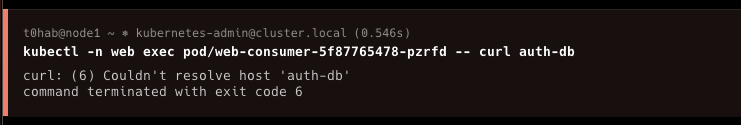
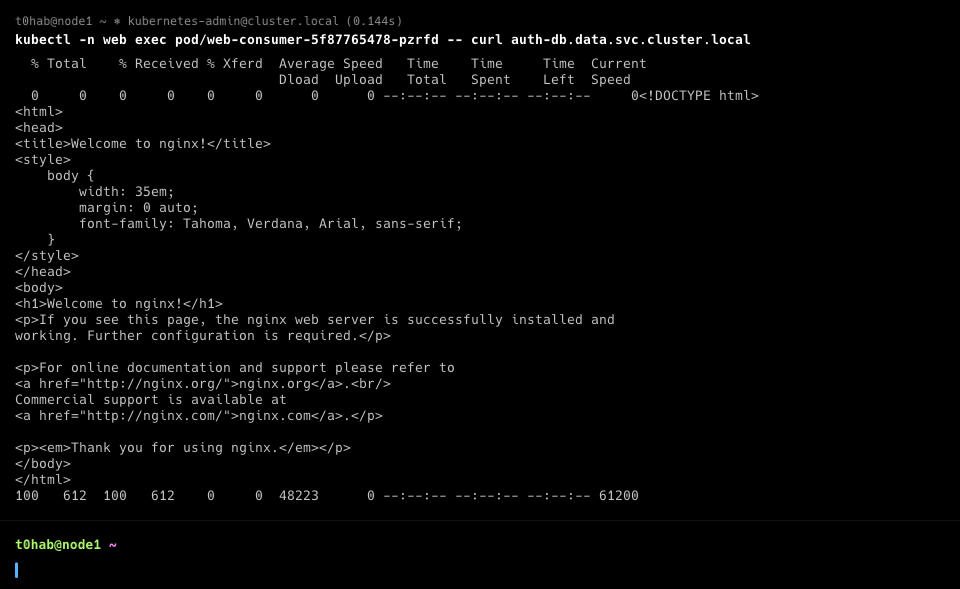

# Домашнее задание к занятию Troubleshooting

### Цель задания

Устранить неисправности при деплое приложения.

### Чеклист готовности к домашнему заданию

1. Кластер K8s.

### Задание. При деплое приложение web-consumer не может подключиться к auth-db. Необходимо это исправить

1. Установить приложение по команде:
```shell
kubectl apply -f https://raw.githubusercontent.com/netology-code/kuber-homeworks/main/3.5/files/task.yaml
```
2. Выявить проблему и описать.
3. Исправить проблему, описать, что сделано.
4. Продемонстрировать, что проблема решена.


### Правила приёма работы

1. Домашняя работа оформляется в своём Git-репозитории в файле README.md. Выполненное домашнее задание пришлите ссылкой на .md-файл в вашем репозитории.
2. Файл README.md должен содержать скриншоты вывода необходимых команд, а также скриншоты результатов.
3. Репозиторий должен содержать тексты манифестов или ссылки на них в файле README.md.

### Решение

* Запустим предложенный в задании манифест Kubernetes и оценим результат


* Из вывода понятно, что в кластере не хватает namespace'ов web и data. Создадим эти два namespace'a


* Снова попробуем запустить предложенный в задании манифест Kubernetes и оценим результат

```bash
kubectl apply -f https://raw.githubusercontent.com/netology-code/kuber-homeworks/main/3.5/files/task.yaml
deployment.apps/web-consumer created
deployment.apps/auth-db created
service/auth-db created
```

* Видим, что развертывание прошло успешно. Оценим созданные ресурсы в пространстве имен `data` и `web`

```bash
kubectl get all -n data -o wide
NAME                           READY   STATUS    RESTARTS   AGE   IP            NODE    NOMINATED NODE   READINESS GATES
pod/auth-db-7b5cdbdc77-vt9d5   1/1     Running   0          50s   10.233.71.7   node3   <none>           <none>

NAME              TYPE        CLUSTER-IP     EXTERNAL-IP   PORT(S)   AGE   SELECTOR
service/auth-db   ClusterIP   10.233.53.50   <none>        80/TCP    50s   app=auth-db

NAME                      READY   UP-TO-DATE   AVAILABLE   AGE   CONTAINERS   IMAGES         SELECTOR
deployment.apps/auth-db   1/1     1            1           50s   nginx        nginx:1.19.1   app=auth-db

NAME                                 DESIRED   CURRENT   READY   AGE   CONTAINERS   IMAGES         SELECTOR
replicaset.apps/auth-db-7b5cdbdc77   1         1         1       50s   nginx        nginx:1.19.1   app=auth-db,pod-template-hash=7b5cdbdc77
```
```bash
kubectl get all -n web -o wide
NAME                                READY   STATUS    RESTARTS   AGE     IP             NODE    NOMINATED NODE   READINESS GATES
pod/web-consumer-5f87765478-jlkld   1/1     Running   0          2m56s   10.233.71.8    node3   <none>           <none>
pod/web-consumer-5f87765478-pzrfd   1/1     Running   0          2m56s   10.233.74.72   node4   <none>           <none>

NAME                           READY   UP-TO-DATE   AVAILABLE   AGE     CONTAINERS   IMAGES                    SELECTOR
deployment.apps/web-consumer   2/2     2            2           2m56s   busybox      radial/busyboxplus:curl   app=web-consumer

NAME                                      DESIRED   CURRENT   READY   AGE     CONTAINERS   IMAGES                    SELECTOR
replicaset.apps/web-consumer-5f87765478   2         2         2       2m56s   busybox      radial/busyboxplus:curl   app=web-consumer,pod-template-hash=5f87765478
```

* Видим, что все ресурсы созданы корректно в пространствах имен data и web. Для дальнейшего поиска проблемы оценим логи deployment'ов `auth-db` и `web-consumer`


* Из логов видно, что под web-consumer-5f87765478-pzrfd не может выполнить разрешение имени `auth-db`. Для уточнения ситуации попробуем выполнить разрешение имени `auth-db` изнутри пода



* Разрешение имени не работает также изнутри пода. Попробуем выполнить разрешение изнутри пода по полному имени



* Видим, что по полному имени разрешение изнутри пода работает. Соотвественно, необходимо выполнить редактирование манифеста для deployment'a `web-consumer`, заменив в нем сокращенное имя `auth-db` на полное имя `auth-db.data.svc.cluster.local` в следующем фрагменте конфигурации в блоке `- command:`

```bash
kubectl -n web edit deployments web-consumer
```
```bash
      labels:
        app: web-consumer
    spec:
      containers:
      - command:
        - sh
        - -c
        - while true; do curl auth-db.data.svc.cluster.local; sleep 5; done
        image: radial/busyboxplus:curl
        imagePullPolicy: IfNotPresent
        name: busybox
        resources: {}
        terminationMessagePath: /dev/termination-log
        terminationMessagePolicy: File
      dnsPolicy: ClusterFirst
      restartPolicy: Always
      schedulerName: default-scheduler
      securityContext: {}
      terminationGracePeriodSeconds: 30
status:
  availableReplicas: 2
  conditions:
  - lastTransitionTime: "2024-02-18T13:50:09Z"
    lastUpdateTime: "2024-02-18T13:50:09Z"
    message: Deployment has minimum availability.
    reason: MinimumReplicasAvailable
    status: "True"
    type: Available
  - lastTransitionTime: "2024-02-18T13:49:56Z"
    lastUpdateTime: "2024-02-18T14:33:41Z"
    message: ReplicaSet "web-consumer-6fb89747cf" has successfully progressed.
    reason: NewReplicaSetAvailable
    status: "True"
    type: Progressing
  observedGeneration: 2
  readyReplicas: 2
  replicas: 2
  updatedReplicas: 2
```
* После завершения редактирования манифеста, поды автоматически пересоздались
```bash
kubectl -n web edit deployments web-consumer
deployment.apps/web-consumer edited
```
* Вновь оценим логи deployment'ов auth-db и web-consumer

Логи `auth-db`


Логи `web-consumer`


* Приложение web-consumer получило доступ к приложению auth-db. Проблема решена.